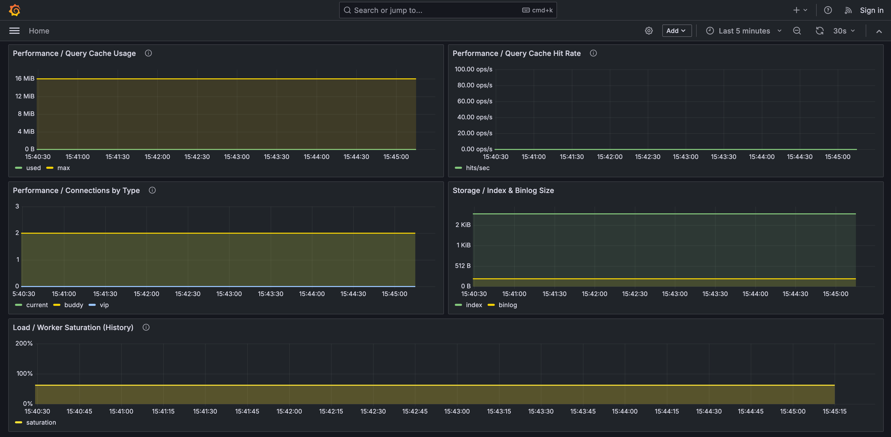
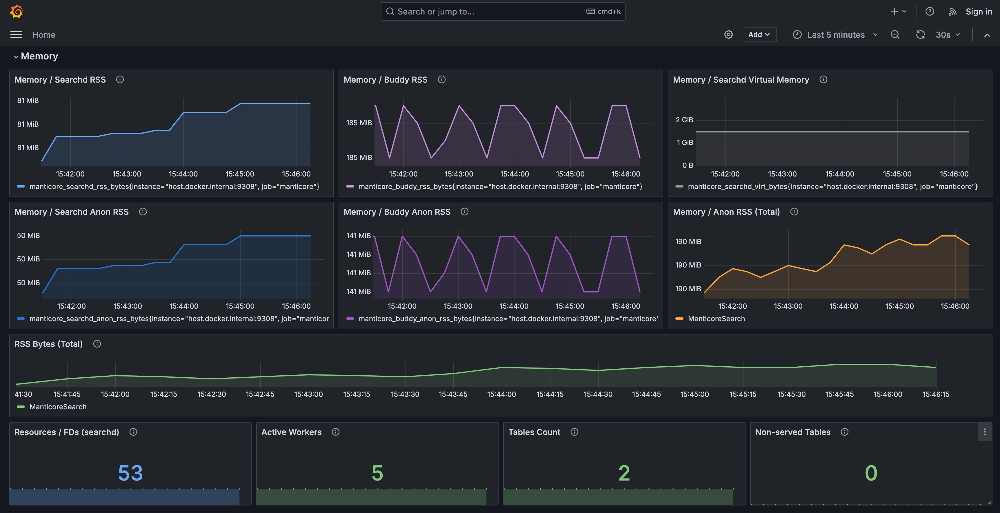
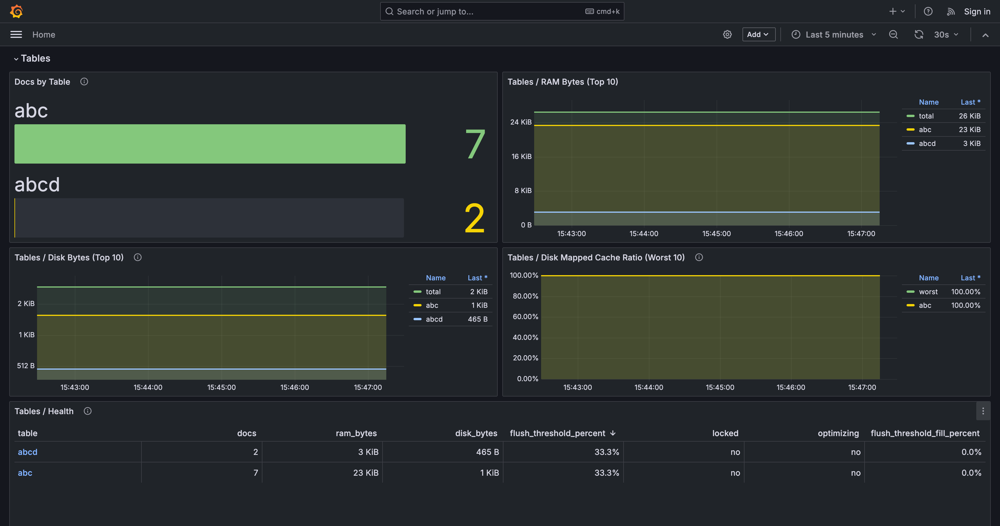
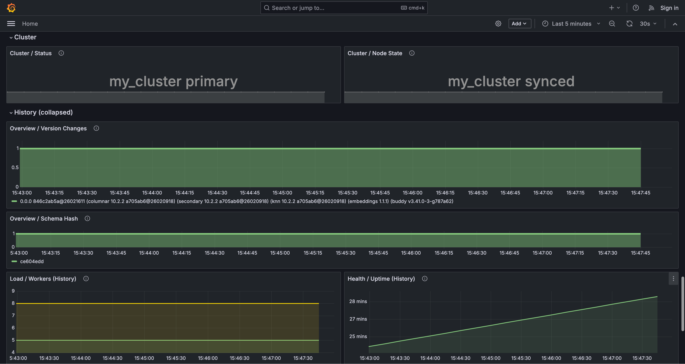
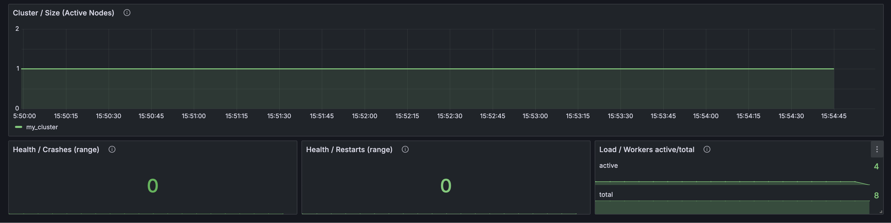

# Grafana + Prometheus for Manticore Search

Monitoring stack for Manticore Search instances — a single Docker image with Grafana and Prometheus pre-configured with dashboards and alert rules.








## Quick start

```bash
docker run -e MANTICORE_TARGETS=localhost:9308 -p 3000:3000 manticoresearch/dashboard:latest
```

## Environment variables

| Variable | Default | Description |
|----------|---------|-------------|
| `MANTICORE_TARGETS` | `localhost:9308` | Comma-separated list of Manticore Search instances |
| `GF_AUTH_ENABLED` | `false` | Set to `true` to enable Grafana login (default: anonymous admin access) |

### Multiple instances

```bash
docker run -e MANTICORE_TARGETS=node1:9308,node2:9308,node3:9308 -p 3000:3000 manticoresearch/dashboard:latest
```

## Access

- Grafana: http://localhost:3000 (no login required by default; set `GF_AUTH_ENABLED=true` to require login, default credentials: `admin` / `admin`)
- Prometheus is available inside the container on port 9090

## How it works

1. On startup, the entrypoint generates Prometheus targets from `MANTICORE_TARGETS`
2. Supervisord starts both Prometheus and Grafana inside a single container
3. Grafana is pre-provisioned with a Prometheus datasource and a Manticore Search dashboard

## Data persistence

By default all data is lost when the container is removed. To keep Grafana dashboards, settings, and Prometheus metrics across restarts, mount these paths:

| Path | Description |
|------|-------------|
| `/var/lib/grafana` | Grafana database, dashboards, and settings |
| `/var/lib/prometheus` | Prometheus time-series data |

```bash
docker run \
  -e MANTICORE_TARGETS=localhost:9308 \
  -v grafana_data:/var/lib/grafana \
  -v prometheus_data:/var/lib/prometheus \
  -p 3000:3000 \
  manticoresearch/dashboard:latest
```

## Build locally

```bash
docker build -t manticoresearch/dashboard .
docker run -e MANTICORE_TARGETS=localhost:9308 -p 3000:3000 manticoresearch/dashboard
```
